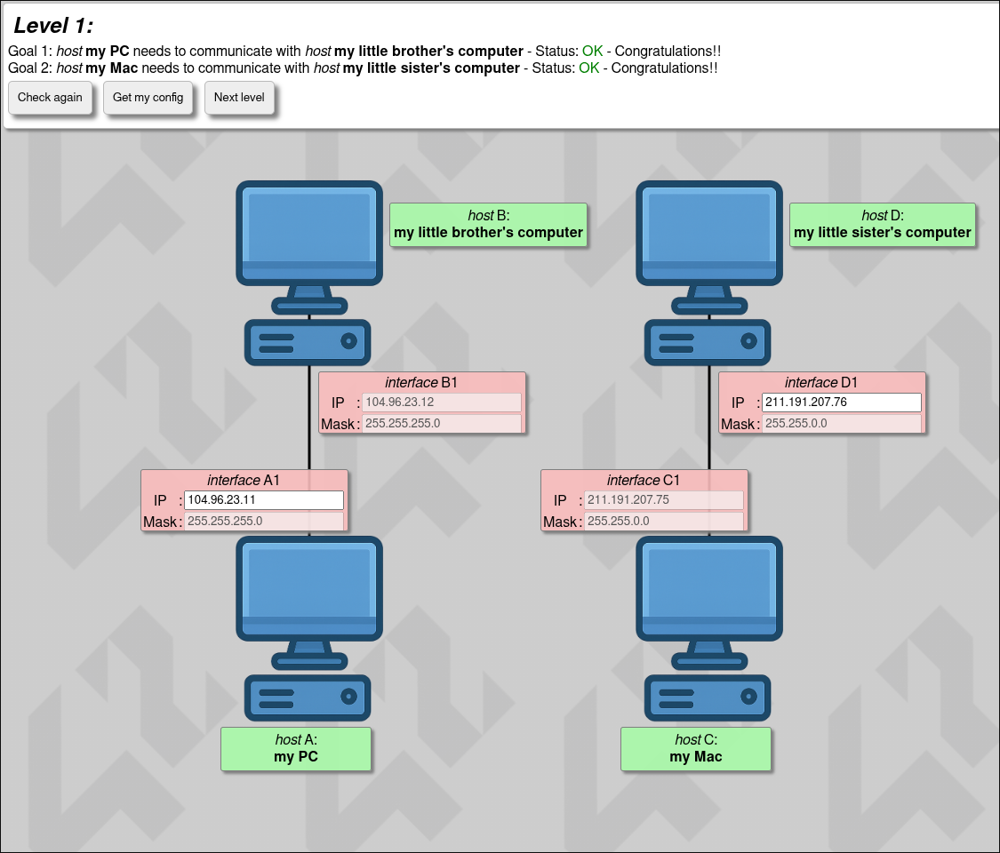
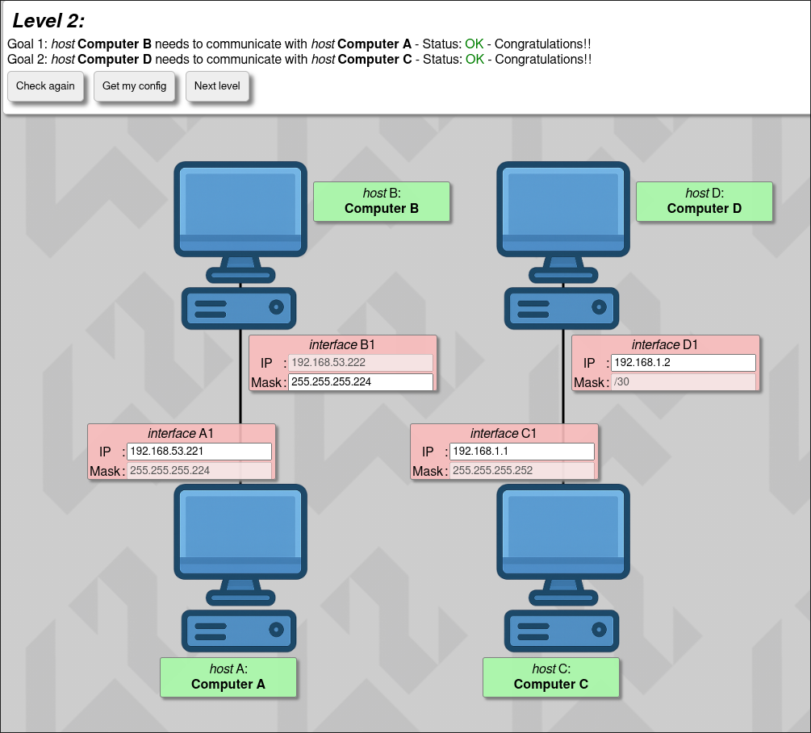
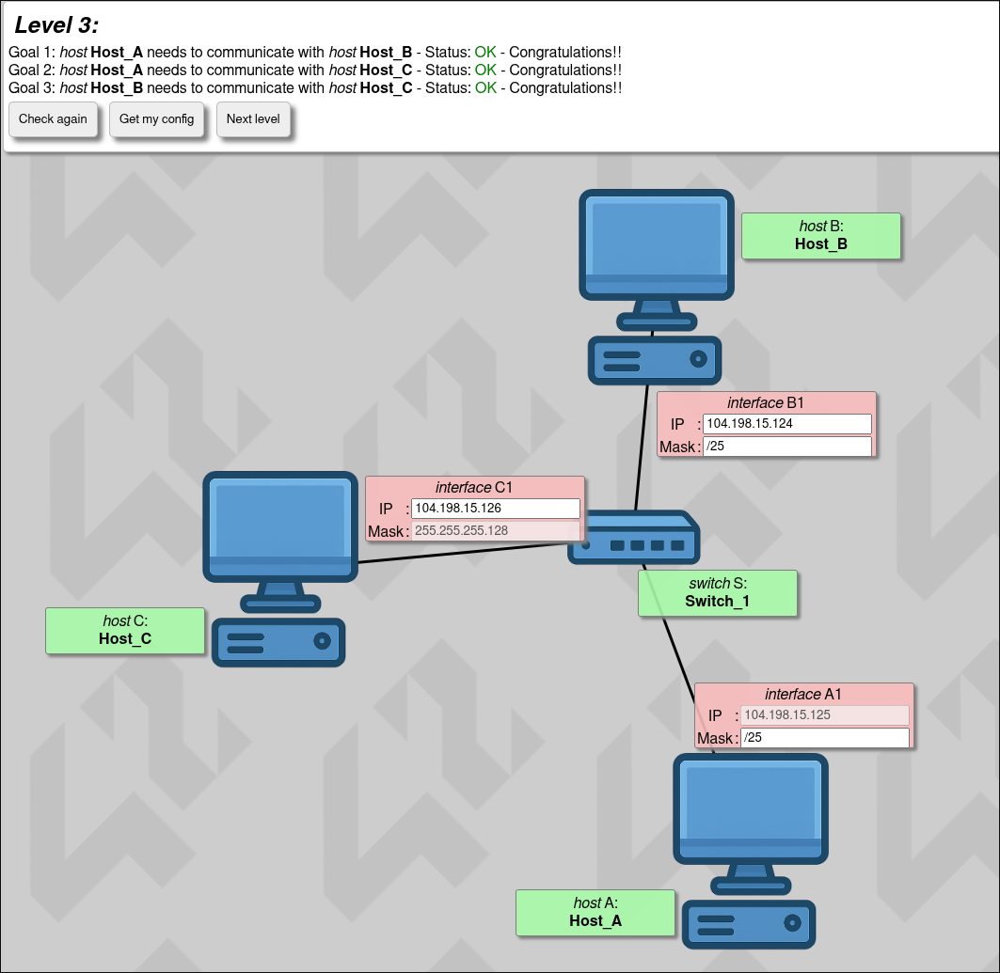
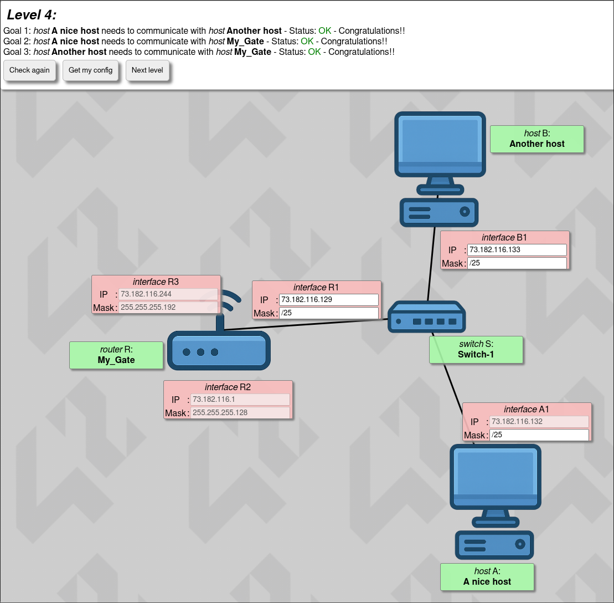
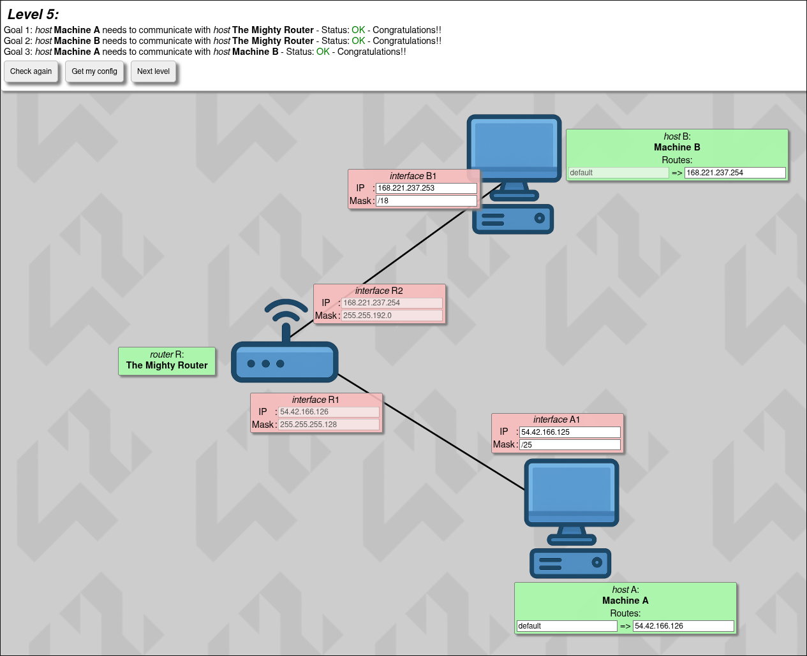
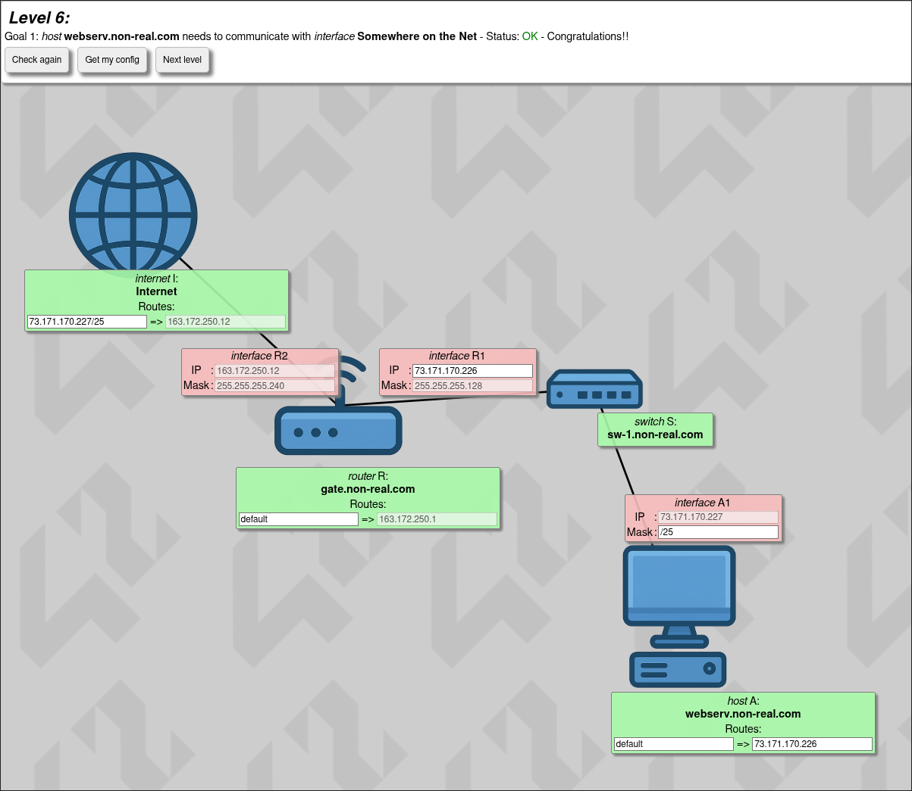
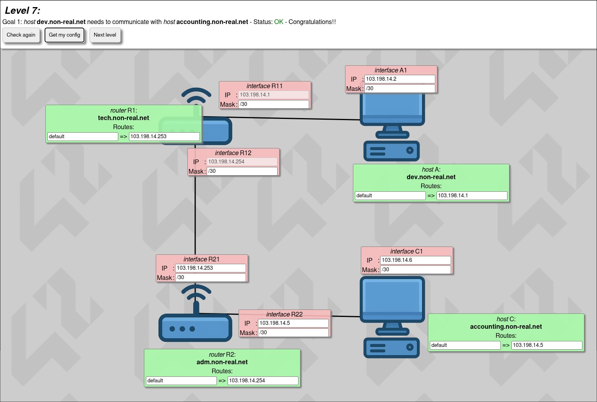
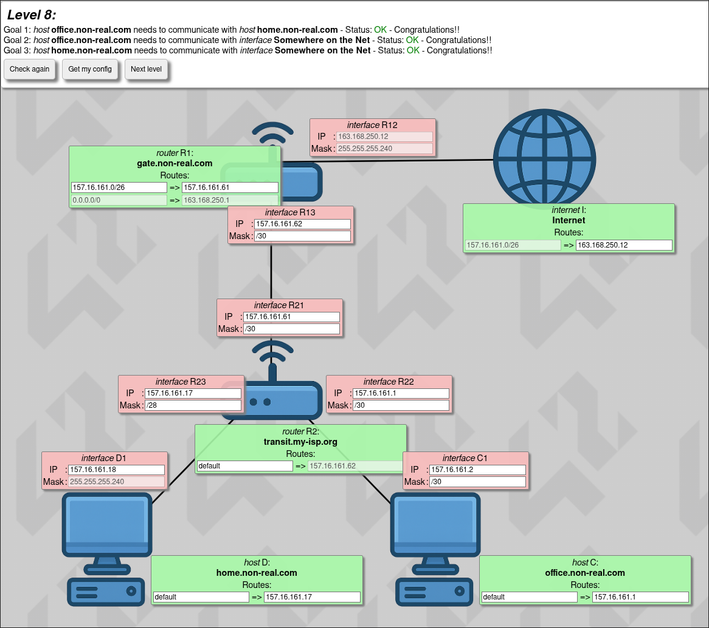
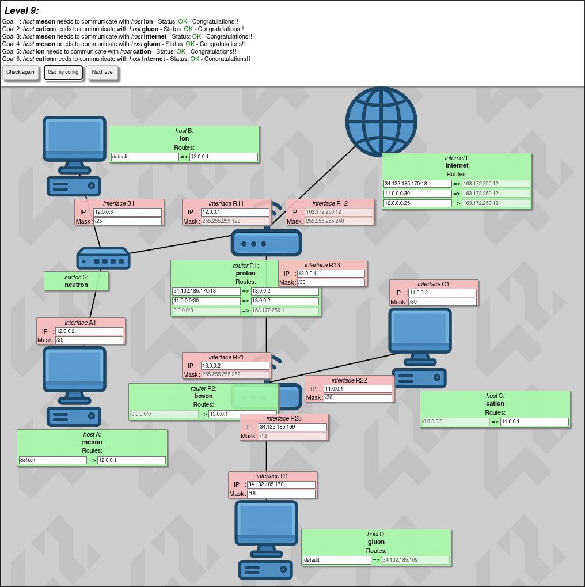
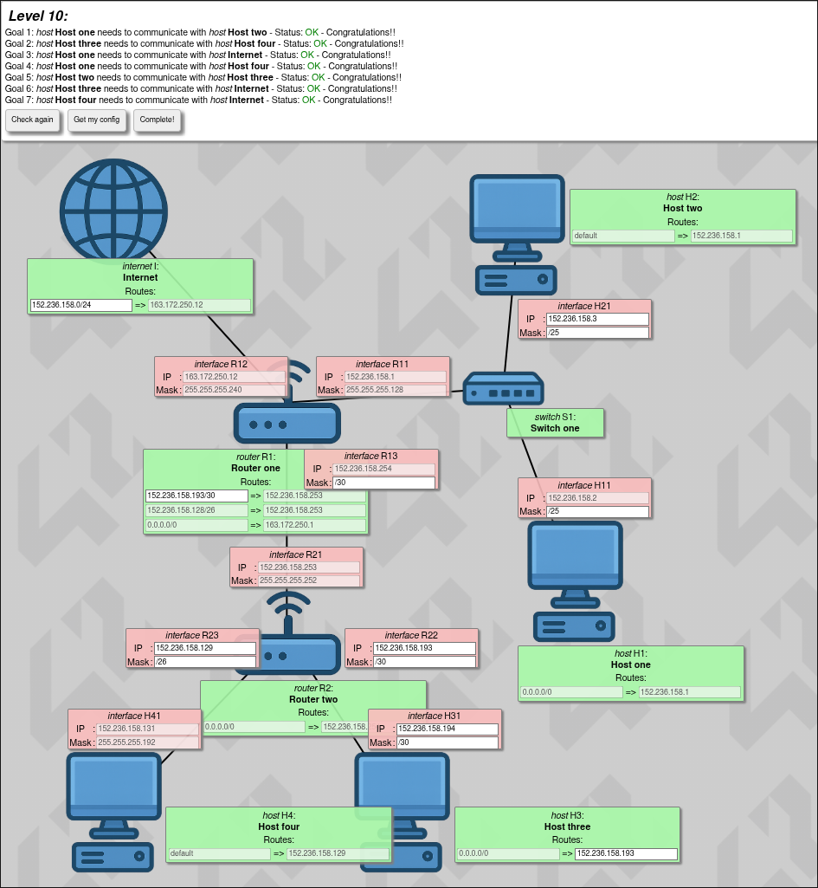

*This project has been created as part of the 42 curriculum by jtarvain*
# Net_practice
## Description
NetPractice is a system administration and networking exercise project from the 42 curriculum. The goal is to develop a solid understanding of TCP/IP addressing by solving a series of 10 progressively challenging network configuration puzzles.

Each level presents a broken or incomplete network diagram. The task is to correctly configure IP addresses, subnet masks, and routing tables so that all hosts and routers in the network can communicate with each other. There is no coding involved — the project is purely about understanding how networks work.

Topics covered include:
- IP addressing (IPv4) and CIDR notation
- Subnet masks and subnetting
- Default gateways and routing tables
- Point-to-point links
- Routers and switches
- OSI model layers (with a focus on Layer 3 — Network)

## Instructions
### Running the training interface
1. Clone or download the repository.
2. Open `index.html` in a web browser — no server or installation required.
3. Fill in the empty fields (IP addresses, subnet masks, routes) and click **Check** to validate your solution.
4. Once a level is solved, click **Get my config** to export the configuration as a file.

### Submission
Each of the 10 levels must be solved and exported using the **Get my config** button. Place all 10 exported configuration files at the root of the repository before submitting.

## Resources
## Screenshots

Level 1

Level 2

Level 3

Level 4

Level 5

Level 6

Level 7

Level 8

Level 9

Level 10

### References
| Resource | Description |
|---|---|
| [You suck at subnetting](https://www.youtube.com/watch?v=5WfiTHiU4x8&list=PLIhvC56v63IKrRHh3gvZZBAGvsvOhwrRF) | Video series covering TCP/IP addressing, subnet masks, and CIDR notation from the ground up |
| [What is the OSI Model?](https://www.cloudflare.com/learning/ddos/glossary/open-systems-interconnection-model-osi/) | Overview of the OSI layers |
| [What is the Internet Protocol?](https://www.cloudflare.com/learning/network-layer/internet-protocol/) | Explanation of how IP addresses work |

### Networking concepts studied
This project covers the following networking fundamentals:
- **TCP/IP addressing** — IPv4 address structure, classes, and CIDR notation
- **Subnet masks** — calculating network and host ranges, block sizes
- **Default gateways** — how hosts route traffic outside their subnet
- **Routing tables** — configuring next-hop routes and default routes across routers
- **Routers and switches** — their roles and how they differ at Layer 2 vs Layer 3
- **OSI model** — with emphasis on the Network layer (Layer 3) and how it governs packet delivery

### AI usage
Claude (Anthropic) was used as a Socratic study partner during this project — asking questions to guide understanding of subnetting logic, routing table configuration, and diagnosing network topology errors. No solutions were generated directly; AI was used to deepen conceptual understanding.
